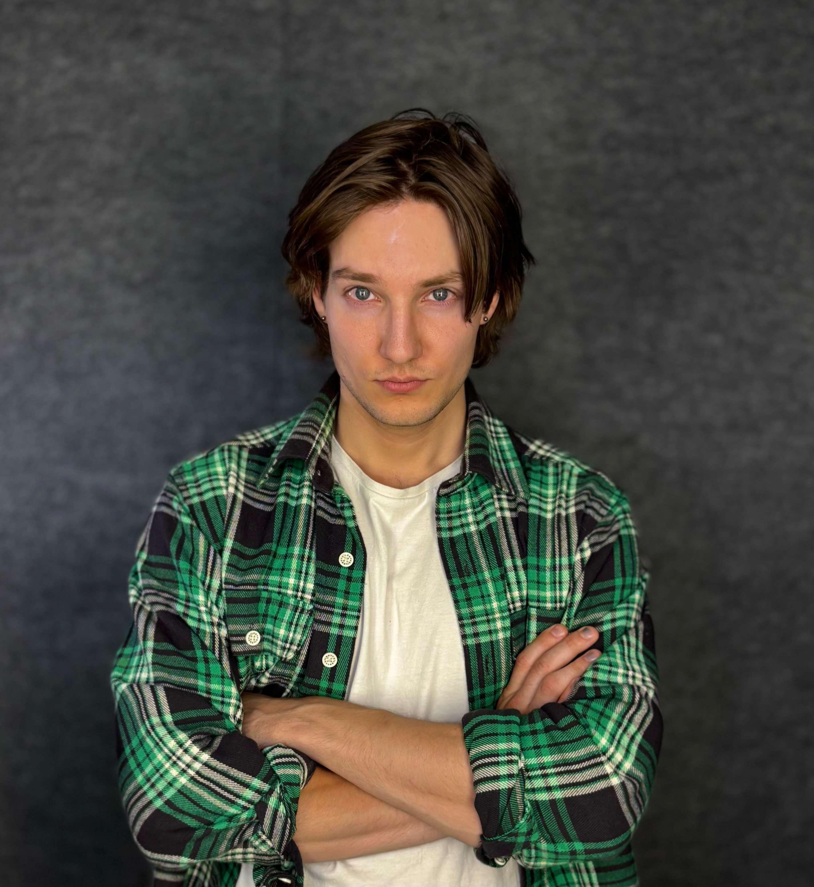

# OSKAR BRANDELL
### Skådespelare | Actor

<!-- Ditt headshot visas här om filen heter headshot.jpg -->

---

## Video (Showreel & Presentation)
*Klicka på länkarna nedan för att öppna videomaterialet:*

[**SE MIN PRESENTATIONSVIDEO HÄR**](https://youtu.be/Qfyiqyy3zrA)
[**SE MIN MONOLOG HÄR**](KLISTRA_IN_LÄNK_TILL_DIN_MONOLOG_HÄR)

---

##  Snabba fakta (Vital Stats)
* **Spelålder:** 20 – 30 år
* **Längd:** 182 cm
* **Vikt:** 75 kg
* **Utseende:** Skandinaviskt
* **Ögonfärg:** Mörkblå
* **Hårfärg & Längd:** Ljusbrun / Långt hår
* **Boende:** Stockholm
* **Språk:** Svenska (modersmål), Engelska (Amerikansk), Spanska, Skånska (dialekt), Uppländska (dialekt)

---

## Branscherfarenhet & Aktuellt

 [**LADDA NER MITT KOMPLETTA CV (PDF)**](Brandell.Oskar-CV.png)

### Aktuellt
* **2026** | **KOPPS** | Nortäljesommarscen
* **2024–2026** | **Calle Flygare Teaterskola**
* **2025** | **Cinemantrix** | Grundkurs i skådespeleri workshop

### Film, TV & Produktioner i urval
* **2020** | **Innan Jag Växer Upp** | Roll: Talroll utan namn | Arbetsgivare: Martin Ekelund
* **2020** | **The Scar That Scares Me** | Roll: Nelson | Arbetsgivare: Michael Asonganyi
* **2020** | **Skattkammarön** | Roll: Mr Arrow | Arbetsgivare: Pegasus

---

##  Utbildning & Träning (Education)
* **2020** | **Masterclass** – Masterclass videokurs med Natalie Portman
* **2020** | **MAF** – Kurs/Workshop: Improvisation
* **2020** | **Kulturama** – Kurs/Workshop: Skådespel för film och tv
* **2020** | **Pegasus** – Kurs/Workshop: Skådespel
* **2020** | **Pegasus** – Kurs/Workshop: Improvisation
* **2020** | **Malmö latin skolan** – Gymnasial: Bild och formgivning
* **2017** | **Högskolan i Gävle** – Universitet: Industri design

---

##  Fler färdigheter (Skills)
* **Yrken & Studio:** Filmproducent, Filmregissör, Fotograf, Författare, Handkamera operatör, Studiovana
* **Fysiskt & Stunt:** Improvisation, Kameravana, Kampsport, Parkour, Scenvana, Skridskor, Skådespeleri, Stunt
* **Musik & Instrument:** Sång, Elbas, Elgitarr, Gitarr

---

##  Kontakt & Portaler
* **E-post:** oskarbrandell@hotmail.se
* **Telefon:** (+46) 76 006 73 13
* **Adress:** Rindögatan 26, Stockholm 115 58

 [**BESÖK MIN IMDB-PROFIL HÄR**](https://imdb.com)
